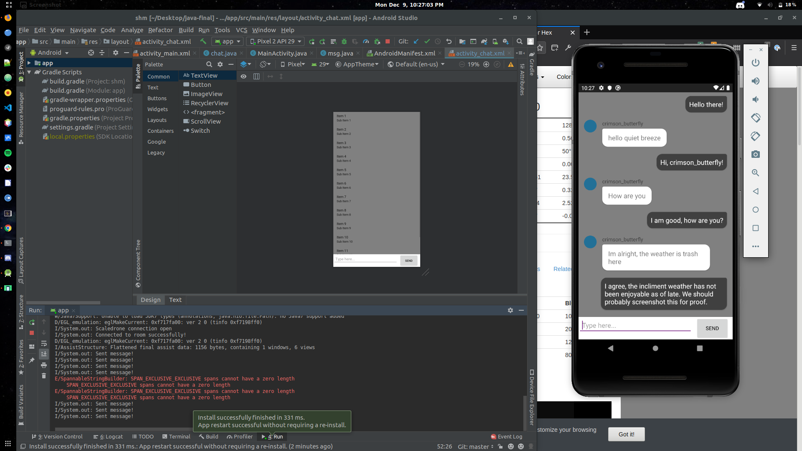
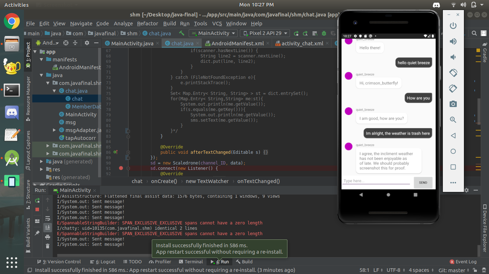

# SHM - Short Hand Messenger
Rd Clare and I (Andrew Piechota) ~~used the TapStrap 2 SDK, seen [here](https://www.tapwithus.com/developers-sdk/),~~ the SDK caused issues with Android Studio, we decided to just bluetooth the TapStrap 2 to Rd's laptop. Combined with [this messager demo](https://www.scaledrone.com/blog/android-chat-tutorial/) to test the functionality of the TapStrap in a messaging application. 

### Disclaimer 
> The messaging program is based off of the demo, with some slight modifications. To make the TapStrap more feasible, we implemented an algorithm which will expand short hand letters to words and even sentences. 

Here is some proof of the app connecting (as this is occasionally spotty).

We used the Scaledrone API to connect to a chatroom and users would have a randomly generated name along with an "avatar" that was just a randomly-colored circle next to their name.

The Scaledrone API can be found [here](https://www.scaledrone.com/).
